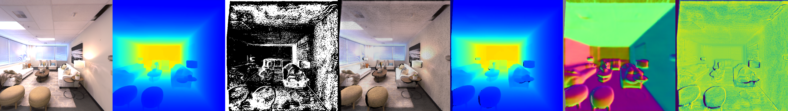
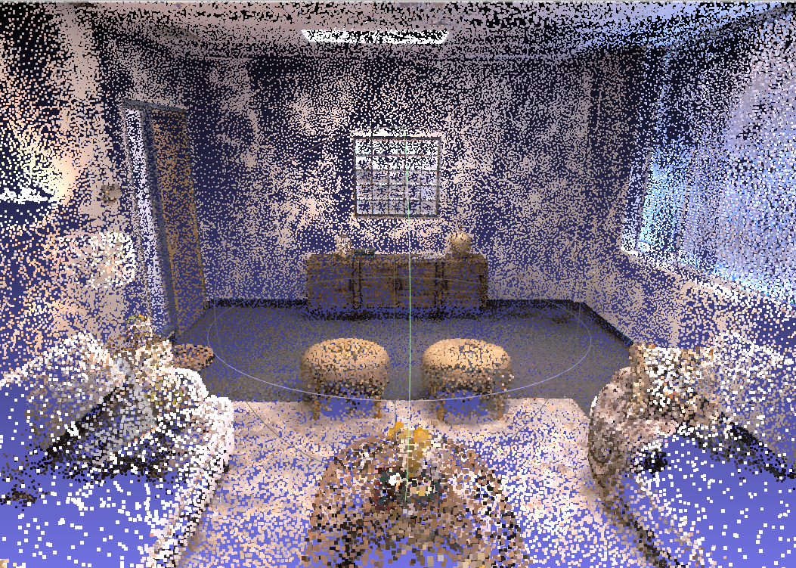
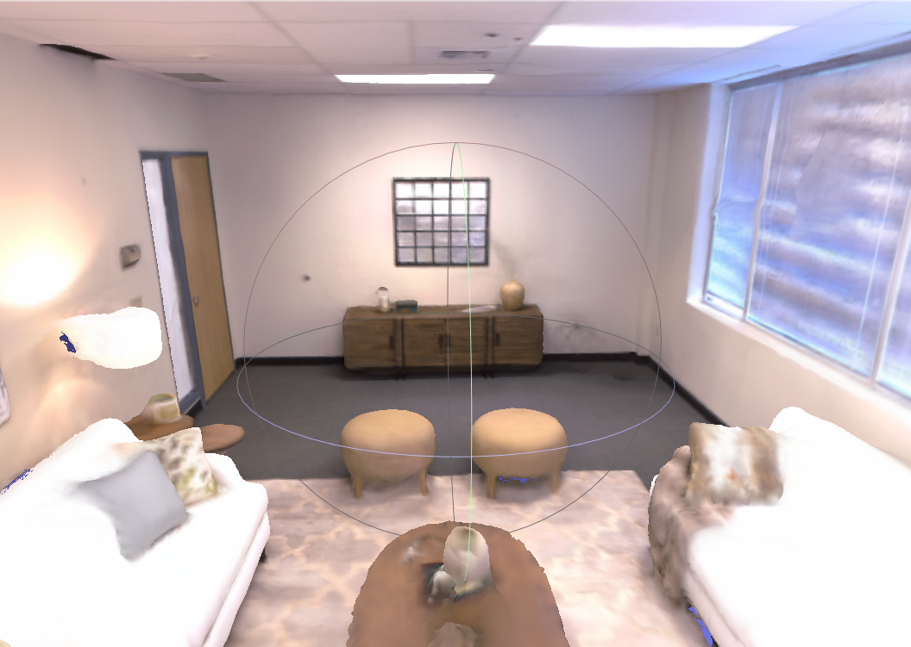

## Welcome to the Pytorch Implementation of "ActMVS: Active Scene Reconstruction with Monocular Multi-View Stereo" for ICRA 2026.


#### 0.Setup
```
conda create -y -n ActMVS python=3.9 cmake=3.14.0
conda activate ActMVS

pip install torch==2.1.2 torchvision==0.16.2 torchaudio==2.1.2 --index-url https://download.pytorch.org/whl/cu118
pip install git+https://github.com/liren-jin/diff-gaussian-rasterization_2d
pip install git+https://github.com/nianticlabs/mvsanywhere

cd simulator
git clone git@github.com:liren-jin/habitat-sim.git
cd habitat-sim
pip install -r requirements.txt
python setup.py install --headless --bullet
```

#### 1.Run
```
sh scripts/run.sh
```

#### 2.Check Results

<div align="center">
  
</div>

<div align="center">
  
</div>

<div align="center">
  
</div>
